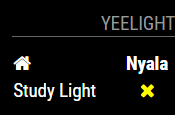
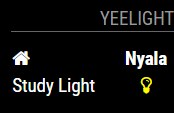

# MMM-Yeelight []

Yeelight Smarthome Module for MagicMirror<sup>2</sup>.
This modules inspired and using some codes from [MMM-Hue](https://github.com/MitchSS/MMM-Hue).

## Supported Devices

| Model                                    | Type |
|------------------------------------------|------|
| E27 White or RGB                         | Bulb |

## Example

   

## Dependencies

* An installation of [MagicMirror<sup>2</sup>](https://github.com/MichMich/MagicMirror)
* [node-yeelight-wifi](https://github.com/Bastl34/node-yeelight-wifi) module of nodejs

## Installation

1. Clone this repo into `~/MagicMirror/modules` directory.
2. Go to `~/MagicMirror/modules/MMM-Yeelight` directory and do `npm install`
3. Configure your `~/MagicMirror/config/config.js`:

    ```
    {
        module: 'MMM-Yeelight',
        position: 'top_right',
        config: {
	  ...
	  devicesInfo: [
	    {alias: 'YEELIGHT_ALIAS_NAME_1', mac: 'YEELIGHT_MAC_ADDRESS_1'},
	    {alias: 'YEELIGHT_ALIAS_NAME_2', mac: 'YEELIGHT_MAC_ADDRESS_2'},
	    ...
	  ]
        }
    }
    ```

## Config Options

| **Option** | **Default** | **Description** |
| --- | --- | --- |
| `colour` | `false` | displaying power status in colour or not |
| `updateInterval` | `600000 ms` (10 minutes) | how often should the devices states refreshed |
| `showOnlyOn` | `false` | if set to true the module shows only the lights which are on |
| `showLabel` | `true` | show header label? |
| `timeout` | `3000` | how long the discovery should be taken |
| `animationSpeed` | `2500 ms` (2.5 s) | Speed of the update animation |
| `devicesInfo` | array of `device_info` | array of device info `{alias: 'YEELIGHT_ALIAS_NAME', mac: 'YEELIGHT_MAC_ADDRESS'}`. It is a must, since the API unable to retrieve device name/alias from SSDP Message |
